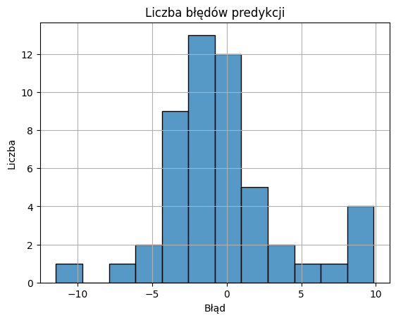

# Application of Feedforward Neural Network in a Selected Regression Problem

## Selected Regression Problem: Predicting House Prices in Boston

## Mounting Google Drive
```bash
from google.colab import drive
drive.mount('/content/drive')
```

## Data Loading
https://www.kaggle.com/datasets/fedesoriano/the-boston-houseprice-data
```bash
import pandas as pd
df = pd.read_csv('/content/drive/My Drive/Colab_Files/boston.csv', sep=';')
```

## Displaying the First 5 Rows
```bash
df.head()
```


## Exploratory Data Analysis
```bash
df.describe()
```


```bash
%matplotlib inline
import matplotlib.pyplot as plt
import seaborn as sns

sns.pairplot(df, diag_kind="kde")
```


## Preparing Input and Output Data
```bash
medv = df['MEDV']
df = df.drop(columns='MEDV')
```

## Outlier Detection Using Z-Score
```bash
import numpy as np
from scipy.stats import zscore

z_scores = np.abs(zscore(df))
outliers_count = (z_scores > 2).sum(axis=0)
print("Liczba outlierów w cechach:")
print(outliers_count)
```
Liczba outlierów w cechach:
[16 39 12 35 16 32 14 22  0  0 16 38 25]

## Correlation Matrix Visualization
```bash
plt.figure(figsize=(10, 8))
sns.heatmap(df.corr(), fmt=".2f", annot=True)
plt.title('Macierz korelacji dostępnych cech')
plt.show()
```


## Target Variable Distribution
```bash
sns.histplot(medv)
plt.title('Liczba domów w konkretnej cenie')
plt.ylabel('Liczba')
plt.xlabel('Cena w tysiącach dolarów')
plt.show()
```


## Data Standardization
```bash
from sklearn.preprocessing import StandardScaler

scaler = StandardScaler()
scaled_data = scaler.fit_transform(df)
```

## Splitting Data into Training and Test Sets
```bash
from sklearn.model_selection import train_test_split

train_data, test_data, train_target, test_target = train_test_split(scaled_data, medv, test_size=0.1, random_state=1)
```

## Baseline Model

### Neural Network Regression
```bash
from sklearn.neural_network import MLPRegressor

neural_network = MLPRegressor(hidden_layer_sizes=(100, 100), activation='logistic', solver="adam", \
                              batch_size=20, shuffle=True, momentum=0.95, alpha=0.01, verbose=False, \
                              max_iter=100, tol=1e-7, random_state=1)
neural_network.fit(train_data, train_target)
```

### Prediction
```bash
medv_prediction = neural_network.predict(test_data)
```

### Model Performance Evaluation
```bash
from sklearn.metrics import mean_squared_error, mean_absolute_error, r2_score

print('MSE: %.2f' % mean_squared_error(test_target, medv_prediction))
print('R2: %.2f' % r2_score(test_target, medv_prediction))
print('MAE: %.2f' % mean_absolute_error(test_target, medv_prediction))
```
MSE: 16.00

R2: 0.83

MAE: 2.88

### Prediction Error Visualization
```bash
errors = test_target - medv_prediction
sns.histplot(errors)
plt.title("Liczba błędów predykcji")
plt.ylabel("Liczba")
plt.xlabel("Błąd")
plt.grid()
```


### Plot of Actual vs Predicted Values
```bash
plt.scatter(test_target, medv_prediction, label='Prognoza')
plt.plot([medv.min(), medv.max()], [medv.min(), medv.max()], 'r--', label='Bezbłędna prognoza')
plt.xlabel("Rzeczywista cena")
plt.ylabel("Prognozowana cena")
plt.title("Rzeczywiste i prognozowane ceny")
plt.legend()
plt.grid()
```


### Training Process Visualization
```bash
plt.plot(neural_network.loss_curve_)
plt.title('Krzywa strat (model bazowy)')
plt.xlabel('Epoka')
plt.ylabel('Wartość błędu')
plt.grid()
```


### Summary of First 10 Predictions
```bash
data_summary = pd.DataFrame({'Rzeczywista cena': test_target.values[:10], 'Prognozowana cena': medv_prediction[:10], \
                             'Błąd': test_target.values[:10] - medv_prediction[:10]})
data_summary.round(2)
```


## Optimized Model

### Hyperparameter Tuning and Neural Network Regression
```bash
from sklearn.model_selection import GridSearchCV

parameters = {
    'hidden_layer_sizes': [(20, 10), (30, 20), (100, 100)],
    'activation': ['logistic', 'tanh', 'relu'],
    'solver': ['sgd', 'adam'],
    'alpha': [0.0001, 0.001, 0.01],
}

grid_search = GridSearchCV(MLPRegressor(batch_size=20, shuffle=True, momentum=0.95, verbose=False, max_iter=100, \
                                        tol=1e-7, random_state=1), parameters, cv=5, scoring='r2', verbose=0, n_jobs=-1)
grid_search.fit(train_data, train_target)

print("Najlepsze parametry:", grid_search.best_params_)
print('Najlepszy wynik R2 (cross validation): %.2f' % grid_search.best_score_)
```
Najlepsze parametry: {'activation': 'tanh', 'alpha': 0.01, 'hidden_layer_sizes': (100, 100), 'solver': 'sgd'}
Najlepszy wynik R2 (cross validation): 0.86
/usr/local/lib/python3.11/dist-packages/sklearn/neural_network/_multilayer_perceptron.py:691: ConvergenceWarning: Stochastic Optimizer: Maximum iterations (100) reached and the optimization hasn't converged yet.
  warnings.warn(

### Selecting Best Model and Making Predictions
```bash
best_model = grid_search.best_estimator_
medv_best_prediction = best_model.predict(test_data)
```

### Model Performance Evaluation
```bash
print('MSE: %.2f' % mean_squared_error(test_target, medv_best_prediction))
print('R2: %.2f' % r2_score(test_target, medv_best_prediction))
print('MAE: %.2f' % mean_absolute_error(test_target, medv_best_prediction))
```

MSE: 9.39

R2: 0.90

MAE: 2.29

### Prediction Error Visualization
```bash
best_errors = test_target - medv_best_prediction
sns.histplot(best_errors)
plt.title("Liczba błędów predykcji")
plt.ylabel("Liczba")
plt.xlabel("Błąd")
plt.grid()
```


### Plot of Actual vs Predicted Values
```bash
plt.scatter(test_target, medv_best_prediction, label='Prognoza')
plt.plot([medv.min(), medv.max()], [medv.min(), medv.max()], 'r--', label='Bezbłędna prognoza')
plt.xlabel("Rzeczywista cena")
plt.ylabel("Prognozowana cena")
plt.title("Rzeczywiste i prognozowane ceny")
plt.legend()
plt.grid()
```


### Training Process Visualization
```bash
plt.plot(best_model.loss_curve_)
plt.title('Krzywa strat (po optymalizacji)')
plt.xlabel('Epoka')
plt.ylabel('Wartość błędu')
plt.grid()
```


### Summary of First 10 Predictions
```bash
best_data_summary = pd.DataFrame({'Rzeczywista cena': test_target.values[:10], 'Prognozowana cena': medv_best_prediction[:10], \
                                  'Błąd': test_target.values[:10] - medv_best_prediction[:10]})
best_data_summary.round(2)
```

